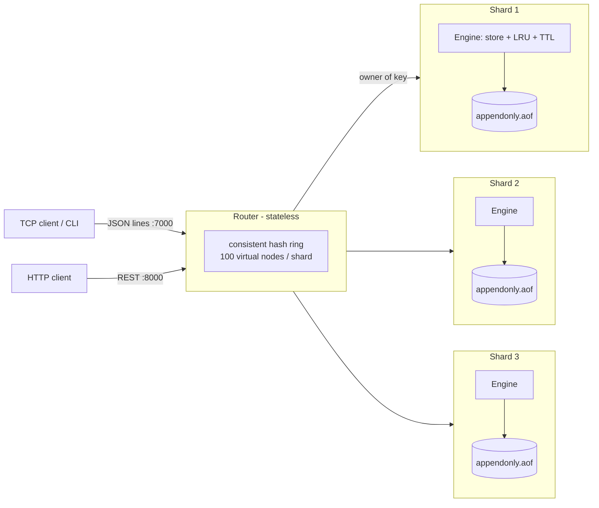

# kvstore: a Redis-inspired distributed key-value store

A distributed, in-memory key-value datastore built from scratch in Python. It has
TTL expiry, LRU eviction, append-only-file persistence with crash recovery, and
horizontal sharding with consistent hashing. Each node serves a
**TCP data plane** for fast key-value traffic and a
**FastAPI control plane** for REST access, health checks and introspection.

[](https://github.com/TejasKhilare/Redis-like-DataStorage/actions/workflows/ci.yml)


## Architecture



Each node runs as a single process with a single event loop. That process hosts
two servers:

| Plane | Transport | Used for |
|---|---|---|
| Data plane | asyncio TCP, newline-delimited JSON | clients, the CLI, router → shard traffic |
| Control plane | FastAPI (HTTP) | REST key API, `/health`, `/ready`, admin, cluster view, OpenAPI docs |

Both servers share one engine, and commands run one at a time. That makes every
command atomic, as in Redis. See [the ADRs](docs/adr/) for why.

## Features

**Engine**
- Values can be any JSON: strings, numbers, objects or arrays. `GET`/`SET` are O(1).
- Commands: `PING SET [EX] GET DEL EXISTS EXPIRE EXPIREAT PEXPIREAT PERSIST TTL PTTL DBSIZE`.
  They are defined in a command table that records each command's arity and key positions.
- Keys expire in two ways. *Lazy*: an expired key is removed when it is read.
  *Active*: 10 times a second, a background task samples up to 20 keys that
  have a TTL, removes the expired ones, and samples again while more than 25%
  of a sample was expired (the same heuristic as Redis). Sampling picks from an
  array that holds only keys with a TTL, so each cycle costs O(sample) rather
  than O(keyspace).
- LRU eviction when the key count reaches `max_keys`, with O(1) operations
  (`OrderedDict`). Eviction policies are pluggable.

**Persistence**
- Append-only file, one per node. A write is recorded after it has been applied
  in memory and before the client gets its reply, so every acknowledged write
  is in the log.
- The log records a command's effect rather than the request. `EXPIRE k 10`
  becomes an absolute `PEXPIREAT`, and each eviction becomes a `DEL`, so
  replaying the log rebuilds exactly the same keyspace.
- On recovery, a torn final record left by a crash is cut off. Corruption
  anywhere else stops startup instead of silently loading partial data.

**Cluster**
- A stateless router places keys with consistent hashing (MD5, 100 virtual
  nodes per shard). Adding or removing a shard moves about 1/N of the keys.
- Commands whose keys belong to different shards are rejected with
  `CROSS_SHARD`, like Redis Cluster's `CROSSSLOT`.
- If a shard fails, only its keys are affected: they return `503`, while the
  other shards keep serving. The router's `/ready` reports `degraded`.

**Engineering**
- Typed config (pydantic-settings), structured JSON logs, request IDs, and one
  error format across TCP and HTTP.
- 147 tests with 96% coverage; mypy `--strict`; ruff; CI on Linux and Windows;
  Docker image and compose file.

## Quickstart

```bash
python -m venv .venv && . .venv/bin/activate      # Windows: .venv\Scripts\activate
pip install -e ".[dev]"

python scripts/run_cluster.py                      # 3 shards + router, Ctrl+C to stop
```

| Node | TCP | HTTP |
|---|---|---|
| router | 7000 | http://127.0.0.1:8000/docs |
| shard-1 / 2 / 3 | 6379 / 6380 / 6381 | :8001 / :8002 / :8003 |

**Or with Docker:** `docker compose up --build` (the router is on ports 7000 and 8000).

**Or a single node:** `python -m kvstore` (HTTP on :8000, TCP on :6379). Every
setting is read from a `KV_*` environment variable; see [.env.example](.env.example).

### CLI (TCP)

```text
$ python -m kvstore.cli --port 7000
127.0.0.1:7000> SET user:1 '{"name": "tejas", "age": 22}'
OK
127.0.0.1:7000> GET user:1
{
  "name": "tejas",
  "age": 22
}
127.0.0.1:7000> SET session abc EX 100
OK
127.0.0.1:7000> TTL session
(integer) 100
127.0.0.1:7000> DEL user:1 session
(error) CROSS_SHARD: keys in the request belong to different shards
```

### REST (HTTP)

```bash
curl -X PUT localhost:8000/v1/keys/cart:9 -H 'content-type: application/json' \
     -d '{"value": ["apple", "milk"], "ttl_seconds": 60}'
curl localhost:8000/v1/keys/cart:9                 # {"key":"cart:9","value":["apple","milk"]}
curl localhost:8000/v1/cluster/keys/cart:9/owner   # {"key":"cart:9","node":"127.0.0.1:6379"}
```

| Method | Path | Description |
|---|---|---|
| `GET` | `/v1/keys/{key}` | Read a value (`404` if missing) |
| `PUT` | `/v1/keys/{key}` | Create or overwrite a value, with an optional `ttl_seconds` |
| `DELETE` | `/v1/keys/{key}` | Delete a key (`204`) |
| `GET` / `PUT` / `DELETE` | `/v1/keys/{key}/ttl` | Read, set or remove a key's TTL |
| `GET` | `/v1/admin/info` | Node and engine stats |
| `GET` | `/v1/cluster/nodes` | Shard health and latency (router only) |
| `GET` | `/v1/cluster/keys/{key}/owner` | Which shard owns a key (router only) |
| `GET` | `/health`, `/ready` | Liveness and readiness probes |

Errors always use this shape:
`{"error": {"code": "KEY_NOT_FOUND", "message": "key 'x' not found"}}`.

### TCP wire protocol

```text
→ {"command": "SET", "args": ["user:1", {"name": "tejas"}]}
← {"ok": true, "result": "OK"}
← {"ok": false, "error": {"code": "WRONG_ARITY", "message": "..."}}
```

Requests are answered in order, so a client can pipeline them: send many
requests, then read the replies. RESP, the Redis protocol that `redis-cli` and
`redis-benchmark` speak, arrives in Phase 2.

## Project layout

```text
src/kvstore/
├── main.py / __main__.py   app factory, entry point (single worker by design)
├── lifespan.py             per-role startup/shutdown (engine, TCP server, expiry task)
├── core/                   config, structured logging, exception hierarchy
├── api/                    FastAPI: deps, error handlers, middleware, v1 endpoints
├── schemas/                Pydantic request/response models
├── services/               KVService (local engine or routed)
├── engine/                 store, entry, keyset, commands, eviction/, persistence/, expiry
├── protocol/               JSON-lines codec, TCP server, async client
├── cluster/                consistent hash ring, shard router
└── cli.py                  interactive client
tests/{unit,integration}/   147 tests, fake clock (no sleeps in TTL tests)
docs/                       roadmap, architecture decision records
```

## Development

```bash
make check        # ruff + mypy --strict + pytest with coverage
make test         # without make: python -m pytest
make format
```

## Design notes

Short records of each decision and its tradeoffs:
- [ADR-0001](docs/adr/0001-control-plane-and-data-plane.md): HTTP control plane and TCP data plane in one process
- [ADR-0002](docs/adr/0002-single-threaded-command-execution.md): single-threaded command execution
- [ADR-0003](docs/adr/0003-aof-logs-effects-not-requests.md): the AOF logs effects, not requests
- [ADR-0004](docs/adr/0004-stateless-router-with-consistent-hashing.md): a stateless router with consistent hashing

The phased plan, covering RESP, benchmarks, replication and failover, is in
[docs/ROADMAP.md](docs/ROADMAP.md).

## License

MIT
