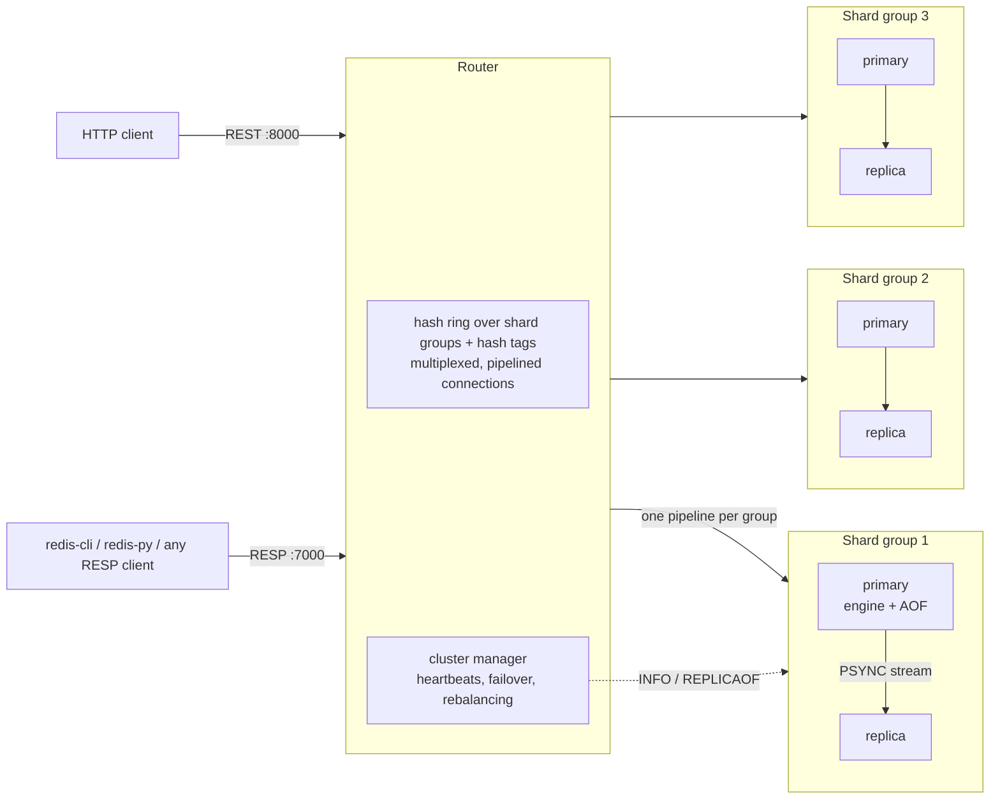
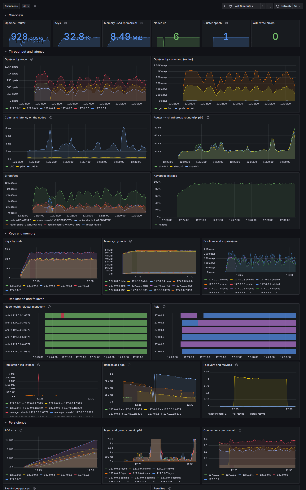
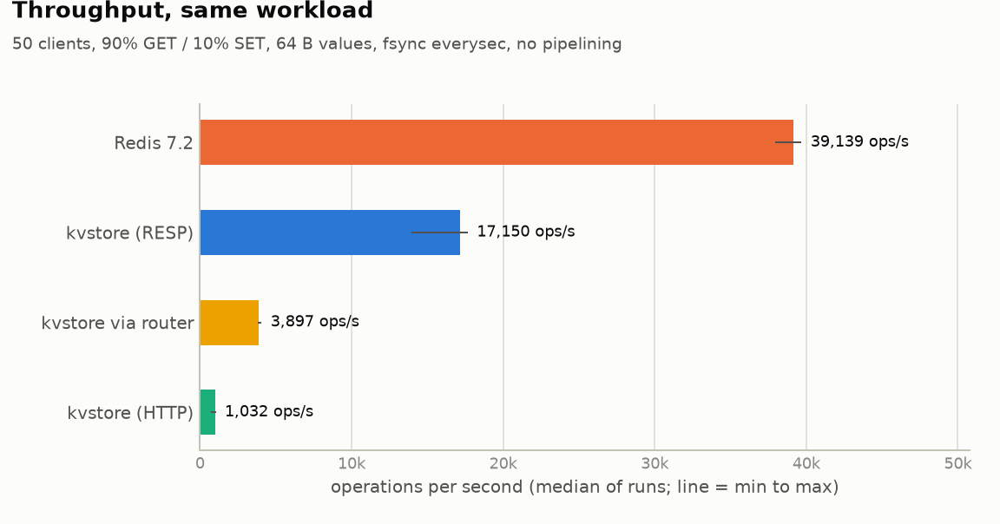

# kvstore: a Redis-compatible distributed key-value store

A distributed, in-memory datastore built from scratch in Python. It speaks
**RESP2, the Redis wire protocol**, so unmodified Redis clients can connect,
including `redis-cli` and `redis-py`. It supports strings, lists, hashes, sets
and sorted sets, and shards data across nodes with consistent hashing.
Each shard is a **replicated group**: a primary streams its writes to its
replicas (Redis's PSYNC protocol), a cluster manager **fails over
automatically** when a primary dies, and shard groups can be **added or
removed live**, moving only the keys that change owner.

Its persistence is modeled on Redis 7: an append-only file with a CRC on every
record, three fsync policies, background rewrite into binary snapshots, and a
manifest file that keeps recovery correct no matter when a crash happens. Each
node also serves a **FastAPI control plane** for REST access, health checks
and introspection.

Every node exposes **Prometheus metrics**, and `docker compose up` brings the
cluster up with Grafana and a ready-made dashboard. It is **chaos-tested**
against real processes: network partitions, a slow node, a disk that fills
up, and `kill -9`.


## Architecture



## Features

**Protocol**
- RESP2 with an incremental parser that handles multi-bulk and inline
  commands, pipelining, and values of any bytes (binary-safe).
- Redis-style error prefixes: `WRONGTYPE`, `OOM`, `CROSSSLOT`, `CLUSTERDOWN`, `MISCONF`.
- The handshake commands clients send on connect work: `HELLO 2`, `CLIENT SETINFO`,
  `COMMAND`/`COMMAND DOCS`, `CONFIG GET`, `INFO`.

**Data types**: about 80 commands:

| Type | Commands |
|---|---|
| string | `GET SET [NX\|XX] [GET] [EX\|PX\|KEEPTTL]`, `SETNX GETDEL MGET MSET INCR[BY] DECR[BY] INCRBYFLOAT APPEND STRLEN` |
| list | `LPUSH RPUSH LPOP RPOP [count]`, `LLEN LRANGE LINDEX LSET LTRIM LREM` |
| hash | `HSET HSETNX HGET HMGET HDEL HGETALL HKEYS HVALS HLEN HEXISTS HINCRBY` |
| set | `SADD SREM SMEMBERS SISMEMBER SCARD SPOP SRANDMEMBER SINTER SUNION SDIFF` |
| sorted set | `ZADD [NX\|XX] [GT\|LT] [CH] [INCR]`, `ZINCRBY ZREM ZSCORE ZCARD ZCOUNT ZRANK ZREVRANK ZRANGE [BYSCORE] [REV] [LIMIT] [WITHSCORES] ZREVRANGE ZRANGEBYSCORE ZREVRANGEBYSCORE ZPOPMIN ZPOPMAX` |
| keys | `DEL UNLINK EXISTS TYPE KEYS EXPIRE PEXPIRE EXPIREAT PEXPIREAT PERSIST TTL PTTL DBSIZE FLUSHALL` |
| server | `PING ECHO TIME SELECT HELLO CLIENT COMMAND CONFIG INFO SAVE BGSAVE BGREWRITEAOF LASTSAVE` |

- Sorted sets use a **skip list with rank spans**, a port of Redis's
  `zskiplist`, alongside a dict. Insert, delete, rank and range lookups take
  O(log n).
- Commands are defined in a **table** that records each command's arity,
  flags and key positions, the same metadata Redis exposes through `COMMAND INFO`.

**Memory and eviction**
- Two limits: `maxmemory` (bytes, tracked by an O(1) per-command estimate) and `max_keys`.
- Four eviction policies:
  - **LRU**: exact, O(1).
  - **LFU**: Redis-style. An 8-bit counter per key grows logarithmically,
    decays while the key sits idle, and victims are chosen by sampling.
  - **random**.
  - **noeviction**: once the limit is reached, commands that add data fail
    with `OOM`, while `DEL` still works.
- A command never evicts the keys it just wrote.

**Persistence** (see ADR-0005, 0006, 0013 and 0014)
- The AOF records the *effect* of each command, not the request:
  - `EXPIRE` is logged as an absolute `PEXPIREAT`;
  - a random `SPOP` is logged as the `SREM` of the members it took;
  - evictions are logged as `DEL`.
- Records are **RESP**, the bytes the replication stream carries, so each
  write is encoded once for both. Every record carries a **CRC32**. On
  restart, a torn final record from a crash is cut off; corruption anywhere
  else stops startup. Older AOFs (JSON records) still load.
- Three fsync policies:
  - `always`: nothing acknowledged is ever lost;
  - `everysec`: a background thread fsyncs once a second;
  - `no`: the OS decides when to flush.
- **Group commit**: a batch of pipelined commands shares one fsync, and no
  reply is sent until its write is on disk.
- **Background rewrite without `fork()`**:
  1. copy the keyspace as of one instant, **incrementally**: values are
     copied in 2 ms slices between commands, and a copy-on-write barrier
     copies any key a command is about to change first;
  2. write the copy to a binary, CRC-checked snapshot on a separate thread;
  3. switch to a new AOF file and record the new set of files in a manifest
     that is replaced atomically.

  The rewrite also starts automatically when the AOF has doubled in size.
  CPython's cycle collector is frozen during the copy (it was causing the
  remaining stalls).
- If an AOF write fails (a full disk, say), the node refuses further writes
  with `MISCONF` instead of silently losing data. Reads keep working: tests
  check it, and so does a run against a real file-size limit
  (`benchmarks.chaos`).

**Replication** (ADR-0008)
- Redis's protocol: `PSYNC` with full resync (a snapshot at an offset) or
  partial resync from a backlog, byte offsets, `REPLCONF ACK`, `ROLE`,
  `INFO replication`, `WAIT`, `min-replicas-to-write`.
- Replicas are read-only and apply the primary's *effects*, so they converge
  exactly. Expiries arrive as `DEL`s; a replica never expires keys on its
  own clock.
- After a promotion, the other replicas continue with a partial resync. A
  former primary whose history diverged must resync fully, which discards
  the writes only it took.

**Failover** (ADR-0009)
- The router's cluster manager sends heartbeats (healthy, then suspect, then
  dead) and promotes the replica with the highest offset under a new
  **epoch**. Routing switches at once; the config is saved in the background.
- Nodes refuse a stale epoch. A replaced primary that returns is fenced,
  demoted and resynced.
- Measured: a `kill -9` of a primary under load is failed over in 1.74 s
  (median of 5) with the default timeouts, and 0.47 s with fast ones. The
  other groups see no errors, and **no acknowledged write was lost in 20
  kills** (see [BENCHMARKS.md](docs/BENCHMARKS.md#failover-round-2)).
- Optional write concern: `KV_WAIT_REPLICAS=1` acknowledges a write only once
  a replica has it.

**Cluster and routing** (ADR-0004, 0010, 0011)
- The consistent-hash ring holds **shard-group ids**, so a failover moves no
  keys. **Hash tags** (`{user:1}:cart`) keep related keys together.
  Cross-group multi-key commands fail with `CROSSSLOT`.
- **Live rebalancing.** Adding or removing a group moves only the keys that
  change owner (≈1/N), with `-ASK`/`-TRYAGAIN` redirects while they move.
  Writes are never lost.
- **A multiplexed router.** Concurrent requests share connections, a
  client's pipeline is sent as one pipeline per group, and retries happen
  only when a write can't be applied twice.
- **Group commit across clients.** Every connection served in one event-loop
  iteration shares one AOF fsync, as in Redis.

**Observability** (ADR-0012)
- `GET /metrics` on every node, in the Prometheus format: ops/s and latency
  histograms per command, errors, keys, memory, expiries and evictions, AOF
  size and fsync latency, group commit, replication offset and lag per
  replica, node health and failovers (from the router), and collector
  pauses.
- Recording is plain Python on the hot path, about 2 µs per command in all
  (a labelled `prometheus_client` histogram alone costs 3 µs). Everything
  that already exists elsewhere is read only when scraped.
- `docker compose up` adds Prometheus and Grafana, with a provisioned
  dashboard of 28 panels. It was checked against a live cluster during a
  real failover:

<picture>
  
</picture>

**Chaos testing** (ADR-0015)
- A fault proxy that delays, partitions and heals the links to a primary,
  and runs with real processes: a disk that fills up (`RLIMIT_FSIZE`) and
  `kill -9`.
- Measured: with its disk full, a node refuses writes (`MISCONF`), still
  serves reads (100 of 100), and loses no acknowledged write across a
  `kill -9`. When a
  primary is partitioned away for 6 s, the majority side loses none of its
  ~28k acknowledged writes. The isolated primary's writes are discarded
  when it rejoins; `min-replicas-to-write 1` stops it taking them after
  2.4 s (see [BENCHMARKS.md](docs/BENCHMARKS.md#chaos-a-full-disk-and-a-network-partition)).
- It found real bugs, each now covered by a test: a 100 ms latency spike
  triggered a failover, and a full disk stopped a node from serving reads.
  Checking the dashboard during a failover also showed that saving the
  cluster config could stall the router.

## Quickstart

```bash
python -m venv .venv && . .venv/bin/activate      # Windows: .venv\Scripts\activate
pip install -e ".[dev]"
python scripts/run_cluster.py --replicas 1         # 3 groups of primary + replica, and a router
```

| Node | RESP (TCP) | HTTP |
|---|---|---|
| router (and cluster manager) | 7000 | http://127.0.0.1:8000/docs |
| shard-1 / 2 / 3 (primaries) | 6379 / 6380 / 6381 | :8001 / :8002 / :8003 |
| their replicas | 6479 / 6480 / 6481 | :8101 / :8102 / :8103 |

Kill a primary (Ctrl+C its process, or `kill -9`), then watch
`GET http://127.0.0.1:8000/v1/cluster/nodes`. Within about 2 s its replica is
the primary, and writes through the router go on.

Or with Docker, the same cluster plus Prometheus and Grafana:

```bash
docker compose up --build        # Grafana at http://localhost:3000, dashboard "kvstore"
docker compose kill shard-1      # watch the failover on the dashboard
docker compose start shard-1     # it rejoins as a replica
```

```text
$ redis-cli -p 7000                    # or: python -m kvstore.cli --port 7000
127.0.0.1:7000> ZADD leaderboard 120 tejas 95 amol
(integer) 2
127.0.0.1:7000> ZRANGE leaderboard 0 -1 WITHSCORES REV
1) "tejas"
2) "120"
3) "amol"
4) "95"
127.0.0.1:7000> MSET {cart:9}:items 3 {cart:9}:total 42
OK
127.0.0.1:7000> MSET a 1 b 2
(error) CROSSSLOT Keys in request don't hash to the same shard
```

```python
import redis  # the official client, unmodified

r = redis.Redis(port=7000, protocol=2, decode_responses=True)
r.hset("user:1", mapping={"name": "tejas", "city": "pune"})
r.rpush("queue", "job-1", "job-2")
```

### REST API

| Method | Path | Description |
|---|---|---|
| `GET` `PUT` `DELETE` | `/v1/keys/{key}` | String values |
| `GET` `PUT` `DELETE` | `/v1/keys/{key}/ttl` | Read / set / remove a TTL |
| `GET` | `/v1/keys/{key}/type` | `string`, `list`, `hash`, `set` or `zset` |
| `POST` | `/v1/commands` | Run any command: `{"command": "ZADD", "args": ["b", 10, "x"]}` |
| `POST` | `/v1/admin/rewrite` | Background snapshot + AOF rewrite (every shard, via the router) |
| `GET` | `/v1/admin/info` | Memory, eviction, persistence and fsync statistics |
| `GET` | `/v1/cluster/nodes` | Every node: role, health (healthy / suspect / dead), offset, epoch |
| `GET` | `/v1/cluster/config`, `/v1/cluster/events` | The routing config (epoch, groups, ring) and failover history |
| `POST` | `/v1/cluster/shards/{id}/failover` | Promote a group's most up-to-date replica |
| `POST` `DELETE` | `/v1/cluster/shards`, `/v1/cluster/shards/{id}` | Add or remove a shard group, moving only the keys that change owner |
| `GET` | `/v1/cluster/keys/{key}/owner` | Which group owns a key, and its primary |
| `GET` | `/health`, `/ready` | Liveness and readiness probes |

Every setting is a `KV_*` environment variable; see [.env.example](.env.example).

## Benchmarks

Measured against Redis 7.2 on the same machine (a 2-core laptop, Linux in
WSL2). There are 25 scenarios, each run 3 times, plus redis-benchmark and an
open-loop latency sweep. Full results, charts and methodology:
**[docs/BENCHMARKS.md](docs/BENCHMARKS.md)**.

<picture>
  <source media="(prefers-color-scheme: dark)" srcset="docs/benchmarks/throughput-dark.png">
  
</picture>

| 50 clients, 64 B values | kvstore | Redis 7.2 |
|---|--:|--:|
| 90% GET, no pipelining | 17,150 ops/s, p50 2.6 ms | 39,139 ops/s, p50 1.3 ms |
| 90% GET, pipeline depth 64 | 53,766 ops/s | 213,894 ops/s (client-bound) |
| 100% SET, `appendfsync always` | 406 ops/s | 7,389 ops/s |
| 100% SET, `appendfsync everysec` | 12,679 ops/s | 40,565 ops/s |
| Rewrite stall, 1M keys | 38–45 ms (313 ms before Phase 5, no fork) | uses fork() |

kvstore reaches 44% of Redis's throughput when clients wait for each reply,
and about 12% when both are CPU-bound. Every bottleneck round 1 found was
then fixed and measured again: the router's pipelining (**6.4×**) and group
commit across clients (**~13 writes per fsync instead of 1**) in Phase 4,
and in Phase 5 cheaper AOF records (**0.62×** to encode a write, 0.53× with
a replica) and an incremental snapshot copy.

**Round 2** (Phase 5) measures the cluster rather than one node:

| | |
|---|---|
| Pipelined GETs, direct to 1 → 3 → 6 shards | 49k → 89k → 96k ops/s, until the laptop's 4 logical CPUs are full |
| The same through one router | 18k → 15k → 12k ops/s: one router is the ceiling (1 core) |
| Recovery, 1M writes over 100k keys | 23.6 s replaying the log, **0.48 s** from a snapshot |
| Failover after `kill -9`, default timeouts | **1.74 s** (median of 5), 0 acknowledged writes lost in 20 kills |
| A 6 s network partition | 0 of ~28k acknowledged writes lost on the majority side |
| Hottest of 3 shards, 100 → 500 virtual nodes | 1.19× → 1.01× its fair share |

```bash
python -m benchmarks.load_gen --port 6379 -c 50 -P 16     # quick measurement
make bench REDIS=path/to/redis/src && make bench-report   # the whole suite
```

## Project layout

```text
src/kvstore/
├── engine/
│   ├── engine.py           dispatch, OOM checks, eviction, group commit, cron
│   ├── store.py            keyspace, expiry, limits, memory accounting, snapshots
│   ├── commands/           the command table: strings, lists, hashes, sets, zsets, keyspace, server
│   ├── datatypes/          skip list, sorted set, list/hash/set containers, sizing
│   ├── eviction/           lru, lfu, random, noeviction
│   └── persistence/        aof (CRC, fsync), snapshot (binary), manifest, manager (rewrites)
├── protocol/               RESP codec, TCP server (cross-client group commit), multiplexed client
├── replication/            stream + backlog, primary (PSYNC, WAIT), replica link, node roles
├── cluster/                topology (groups, epochs), router, manager (failover), migration
├── observability/          metrics (Prometheus text format), collectors, GC policy
├── api/ schemas/ services/ FastAPI control plane (and GET /metrics)
└── cli.py                  redis-cli style client
deploy/                     Prometheus config, Grafana provisioning and dashboard
benchmarks/                 load generator, suite, scaling, recovery, failover, chaos
                            (fault proxy, disk limits), micro, stall watch, report, results
tests/                      445 tests: unit, integration, replication, failover, rebalancing,
                            chaos (partitions, a slow node, a full disk), metrics, the dashboard
docs/                       benchmarks, roadmap, architecture decision records
```

## Development

```bash
python -m pytest --cov     # 445 tests, ~2 min
ruff check . && mypy       # lint + strict typing
```

## Design notes

- [ADR-0001](docs/adr/0001-control-plane-and-data-plane.md): HTTP control plane and TCP data plane
- [ADR-0002](docs/adr/0002-single-threaded-command-execution.md): single-threaded command execution
- [ADR-0003](docs/adr/0003-aof-logs-effects-not-requests.md): the AOF logs effects, not requests
- [ADR-0004](docs/adr/0004-stateless-router-with-consistent-hashing.md): a stateless router with consistent hashing
- [ADR-0005](docs/adr/0005-resp-and-the-value-model.md): RESP and the value model
- [ADR-0006](docs/adr/0006-forkless-rewrite-fsync-and-group-commit.md): rewrite without fork(), fsync policies, group commit
- [ADR-0007](docs/adr/0007-benchmark-methodology.md): benchmark methodology
- [ADR-0008](docs/adr/0008-asynchronous-replication-with-psync.md): asynchronous replication with PSYNC
- [ADR-0009](docs/adr/0009-failure-detection-and-failover-with-epochs.md): failure detection and failover with epochs
- [ADR-0010](docs/adr/0010-rebalancing-with-ask-redirects.md): rebalancing that moves only the keys that change owner
- [ADR-0011](docs/adr/0011-multiplexed-router-and-cross-client-group-commit.md): a multiplexed router and group commit across clients
- [ADR-0012](docs/adr/0012-cheap-metrics-and-a-provisioned-dashboard.md): cheap per-command metrics, and a provisioned dashboard
- [ADR-0013](docs/adr/0013-aof-records-in-resp.md): AOF records in RESP, encoded once for the log and the replicas
- [ADR-0014](docs/adr/0014-incremental-snapshots-and-the-cycle-collector.md): incremental snapshots, and keeping the cycle collector out of the way
- [ADR-0015](docs/adr/0015-chaos-testing-with-a-fault-proxy-and-real-processes.md): chaos testing with a fault proxy and real processes

The roadmap is in [docs/ROADMAP.md](docs/ROADMAP.md). Phase 6 is the
write-up: a design document on the trade-offs, and a demo.

## License

MIT
