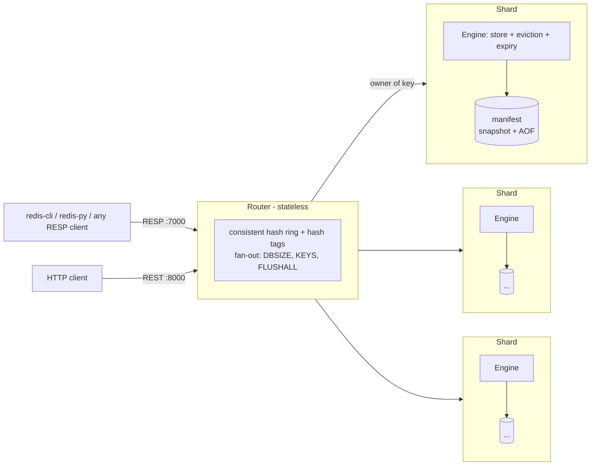

# kvstore: a Redis-compatible distributed key-value store

A distributed, in-memory datastore built from scratch in Python. It speaks
**RESP2, the Redis wire protocol**, so unmodified Redis clients can connect,
including `redis-cli` and `redis-py`. It supports strings, lists, hashes, sets
and sorted sets, and shards data across nodes with consistent hashing.

Its persistence is modeled on Redis 7: an append-only file with a CRC on every
record, three fsync policies, background rewrite into binary snapshots, and a
manifest file that keeps recovery correct no matter when a crash happens. Each
node also serves a **FastAPI control plane** for REST access, health checks
and introspection.


## Architecture



## Features

**Protocol**
- RESP2 with an incremental parser that handles multi-bulk and inline
  commands, pipelining, and values of any bytes (binary-safe).
- Redis-style error prefixes: `WRONGTYPE`, `OOM`, `CROSSSLOT`, `CLUSTERDOWN`, `MISCONF`.
- The handshake commands clients send on connect work: `HELLO 2`, `CLIENT SETINFO`,
  `COMMAND`/`COMMAND DOCS`, `CONFIG GET`, `INFO`.

**Data types**: about 80 commands:

| Type | Commands |
|---|---|
| string | `GET SET [NX\|XX] [GET] [EX\|PX\|KEEPTTL]`, `SETNX GETDEL MGET MSET INCR[BY] DECR[BY] INCRBYFLOAT APPEND STRLEN` |
| list | `LPUSH RPUSH LPOP RPOP [count]`, `LLEN LRANGE LINDEX LSET LTRIM LREM` |
| hash | `HSET HSETNX HGET HMGET HDEL HGETALL HKEYS HVALS HLEN HEXISTS HINCRBY` |
| set | `SADD SREM SMEMBERS SISMEMBER SCARD SPOP SRANDMEMBER SINTER SUNION SDIFF` |
| sorted set | `ZADD [NX\|XX] [GT\|LT] [CH] [INCR]`, `ZINCRBY ZREM ZSCORE ZCARD ZCOUNT ZRANK ZREVRANK ZRANGE [BYSCORE] [REV] [LIMIT] [WITHSCORES] ZREVRANGE ZRANGEBYSCORE ZREVRANGEBYSCORE ZPOPMIN ZPOPMAX` |
| keys | `DEL UNLINK EXISTS TYPE KEYS EXPIRE PEXPIRE EXPIREAT PEXPIREAT PERSIST TTL PTTL DBSIZE FLUSHALL` |
| server | `PING ECHO TIME SELECT HELLO CLIENT COMMAND CONFIG INFO SAVE BGSAVE BGREWRITEAOF LASTSAVE` |

- Sorted sets use a **skip list with rank spans**, a port of Redis's
  `zskiplist`, alongside a dict. Insert, delete, rank and range lookups take
  O(log n).
- Commands are defined in a **table** that records each command's arity,
  flags and key positions, the same metadata Redis exposes through `COMMAND INFO`.

**Memory and eviction**
- Two limits: `maxmemory` (bytes, tracked by an O(1) per-command estimate) and `max_keys`.
- Four eviction policies:
  - **LRU**: exact, O(1).
  - **LFU**: Redis-style. An 8-bit counter per key grows logarithmically,
    decays while the key sits idle, and victims are chosen by sampling.
  - **random**.
  - **noeviction**: once the limit is reached, commands that add data fail
    with `OOM`, while `DEL` still works.
- A command never evicts the keys it just wrote.

**Persistence** (see ADR-0005 and ADR-0006)
- The AOF records the *effect* of each command, not the request:
  - `EXPIRE` is logged as an absolute `PEXPIREAT`;
  - a random `SPOP` is logged as the `SREM` of the members it took;
  - evictions are logged as `DEL`.
- Every record carries a **CRC32**. On restart, a torn final record from a
  crash is cut off; corruption anywhere else stops startup.
- Three fsync policies:
  - `always`: nothing acknowledged is ever lost;
  - `everysec`: a background thread fsyncs once a second;
  - `no`: the OS decides when to flush.
- **Group commit**: a batch of pipelined commands shares one fsync, and no
  reply is sent until its write is on disk.
- **Background rewrite without `fork()`**:
  1. copy the keyspace at a single point in time (O(n) in memory);
  2. write it to a binary, CRC-checked snapshot on a separate thread;
  3. switch to a new AOF file and record the new set of files in a manifest
     that is replaced atomically.

  The rewrite also starts automatically when the AOF has doubled in size.
- If an AOF write fails, the node refuses further writes with `MISCONF`
  instead of silently losing data. Reads keep working.

**Cluster**
- A stateless router uses consistent hashing (100 virtual nodes per shard).
  **Hash tags** (`{user:1}:cart`) place related keys on the same shard.
- A multi-key command whose keys live on different shards fails with `CROSSSLOT`.
- The router answers some commands itself (`PING`, `ECHO`, `COMMAND`) and
  sends others to every shard and combines the replies (`DBSIZE`, `KEYS`, `FLUSHALL`).
- If a shard fails, only its keys are affected (`CLUSTERDOWN` / HTTP 503).
  The router's readiness reports `degraded`.

## Quickstart

```bash
python -m venv .venv && . .venv/bin/activate      # Windows: .venv\Scripts\activate
pip install -e ".[dev]"
python scripts/run_cluster.py                      # 3 shards + router, Ctrl+C to stop
```

| Node | RESP (TCP) | HTTP |
|---|---|---|
| router | 7000 | http://127.0.0.1:8000/docs |
| shard-1 / 2 / 3 | 6379 / 6380 / 6381 | :8001 / :8002 / :8003 |

```text
$ redis-cli -p 7000                    # or: python -m kvstore.cli --port 7000
127.0.0.1:7000> ZADD leaderboard 120 tejas 95 amol
(integer) 2
127.0.0.1:7000> ZRANGE leaderboard 0 -1 WITHSCORES REV
1) "tejas"
2) "120"
3) "amol"
4) "95"
127.0.0.1:7000> MSET {cart:9}:items 3 {cart:9}:total 42
OK
127.0.0.1:7000> MSET a 1 b 2
(error) CROSSSLOT Keys in request don't hash to the same shard
```

```python
import redis  # the official client, unmodified

r = redis.Redis(port=7000, protocol=2, decode_responses=True)
r.hset("user:1", mapping={"name": "tejas", "city": "pune"})
r.rpush("queue", "job-1", "job-2")
```

### REST API

| Method | Path | Description |
|---|---|---|
| `GET` `PUT` `DELETE` | `/v1/keys/{key}` | String values |
| `GET` `PUT` `DELETE` | `/v1/keys/{key}/ttl` | Read / set / remove a TTL |
| `GET` | `/v1/keys/{key}/type` | `string`, `list`, `hash`, `set` or `zset` |
| `POST` | `/v1/commands` | Run any command: `{"command": "ZADD", "args": ["b", 10, "x"]}` |
| `POST` | `/v1/admin/rewrite` | Background snapshot + AOF rewrite (every shard, via the router) |
| `GET` | `/v1/admin/info` | Memory, eviction, persistence and fsync statistics |
| `GET` | `/v1/cluster/nodes`, `/v1/cluster/keys/{key}/owner` | Topology (router only) |
| `GET` | `/health`, `/ready` | Liveness and readiness probes |

Every setting is a `KV_*` environment variable; see [.env.example](.env.example).

## Benchmarks

Measured against Redis 7.2 on the same machine (a 2-core laptop, Linux in
WSL2). There are 25 scenarios, each run 3 times, plus redis-benchmark and an
open-loop latency sweep. Full results, charts and methodology:
**[docs/BENCHMARKS.md](docs/BENCHMARKS.md)**.

<picture>
  <source media="(prefers-color-scheme: dark)" srcset="docs/benchmarks/throughput-dark.png">
  
</picture>

| 50 clients, 64 B values | kvstore | Redis 7.2 |
|---|--:|--:|
| 90% GET, no pipelining | 17,150 ops/s, p50 2.6 ms | 39,139 ops/s, p50 1.3 ms |
| 90% GET, pipeline depth 64 | 53,766 ops/s | 213,894 ops/s (client-bound) |
| 100% SET, `appendfsync always` | 406 ops/s | 7,389 ops/s |
| 100% SET, `appendfsync everysec` | 12,679 ops/s | 40,565 ops/s |
| Rewrite pause, 1M keys | 369 ms (no fork) | uses fork() |

kvstore reaches 44% of Redis's throughput when clients wait for each reply,
and about 12% when both are CPU-bound. The benchmarks also found the next
optimization targets:
- **Group commit across clients** (`always` is 18× behind Redis).
- **Pipelining in the router**, which costs 77% of throughput today.
- **An incremental snapshot copy.**

```bash
python -m benchmarks.load_gen --port 6379 -c 50 -P 16     # quick measurement
make bench REDIS=path/to/redis/src && make bench-report   # the whole suite
```

## Project layout

```text
src/kvstore/
├── engine/
│   ├── engine.py           dispatch, OOM checks, eviction, group commit, cron
│   ├── store.py            keyspace, expiry, limits, memory accounting, snapshots
│   ├── commands/           the command table: strings, lists, hashes, sets, zsets, keyspace, server
│   ├── datatypes/          skip list, sorted set, list/hash/set containers, sizing
│   ├── eviction/           lru, lfu, random, noeviction
│   └── persistence/        aof (CRC, fsync), snapshot (binary), manifest, manager (rewrites)
├── protocol/               RESP codec, TCP server (group commit), async client
├── cluster/                hash ring, router (hash tags, fan-out)
├── api/ schemas/ services/ FastAPI control plane
└── cli.py                  redis-cli style client
benchmarks/                 load generator (RESP/HTTP, open/closed loop), suite, report, results
tests/                      307 tests: unit, integration, redis-py compatibility, crash recovery
docs/                       benchmarks, roadmap, architecture decision records
```

## Development

```bash
python -m pytest --cov     # 307 tests, ~65s
ruff check . && mypy       # lint + strict typing
```

## Design notes

- [ADR-0001](docs/adr/0001-control-plane-and-data-plane.md): HTTP control plane and TCP data plane
- [ADR-0002](docs/adr/0002-single-threaded-command-execution.md): single-threaded command execution
- [ADR-0003](docs/adr/0003-aof-logs-effects-not-requests.md): the AOF logs effects, not requests
- [ADR-0004](docs/adr/0004-stateless-router-with-consistent-hashing.md): a stateless router with consistent hashing
- [ADR-0005](docs/adr/0005-resp-and-the-value-model.md): RESP and the value model
- [ADR-0006](docs/adr/0006-forkless-rewrite-fsync-and-group-commit.md): rewrite without fork(), fsync policies, group commit
- [ADR-0007](docs/adr/0007-benchmark-methodology.md): benchmark methodology

The roadmap is in [docs/ROADMAP.md](docs/ROADMAP.md). Phase 4 adds replication,
failover and router pipelining.

## License

MIT
