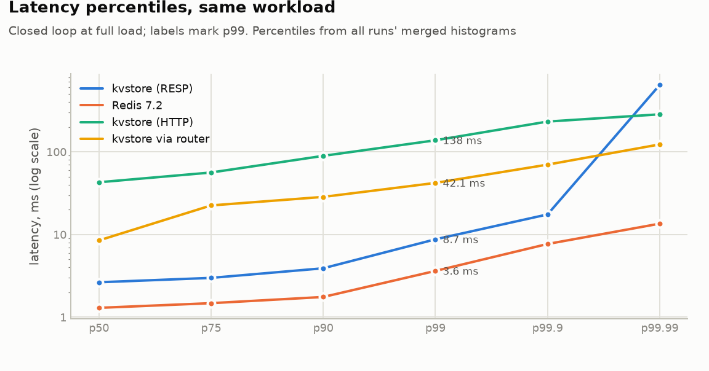
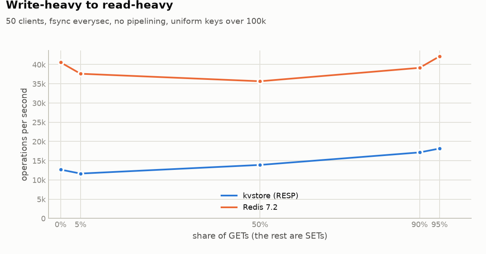
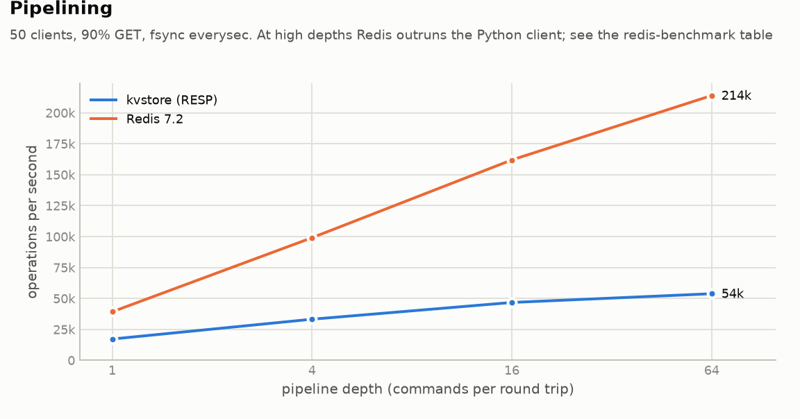
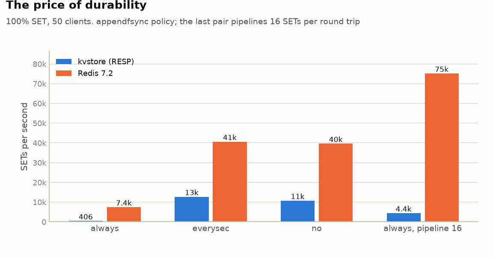
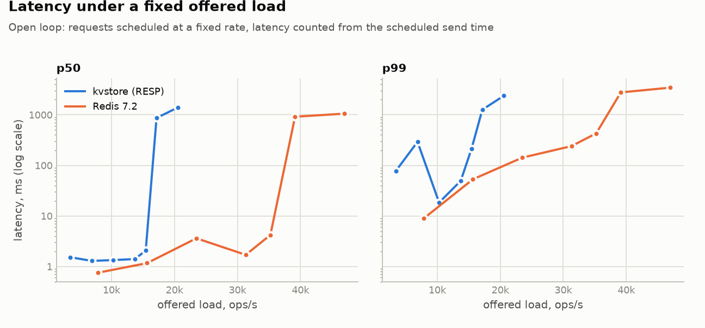

# Benchmarks

Phase 3 measures kvstore before optimizing it, compares it against Redis 7.2
on the same machine, and identifies the bottlenecks. Every number here comes
from [`benchmarks/results/wsl2-i5-7200u.json`](../benchmarks/results/wsl2-i5-7200u.json);
every table is in [results.md](benchmarks/results.md). The method is described
in [ADR-0007](adr/0007-benchmark-methodology.md).

Later phases add sections at the end: Phase 4's before-and-after and
failover measurements, and Phase 5's round 2. Round 2 covers throughput
with 1, 3 and 6 shards, key spread, recovery time, failover, chaos, and what
Phase 5's own changes cost.

## Summary

| | kvstore | Redis 7.2 | ratio |
|---|--:|--:|--:|
| Throughput, 90% GET, no pipelining | **17,150 ops/s** | 39,139 ops/s | 0.44× |
| Latency p50 / p99, same load | 2.6 / 8.7 ms | 1.3 / 3.6 ms | |
| Throughput, pipeline depth 64 | **53,766 ops/s** | 213,894 ops/s¹ | |
| CPU-bound GETs (redis-benchmark, `-P 16`) | 60,328 ops/s | 522,739 ops/s | 0.12× |
| Writes, `appendfsync always` | 406 SETs/s | 7,389 SETs/s | **0.05×** |
| Writes, `appendfsync everysec` | 12,679 SETs/s | 40,565 SETs/s | 0.31× |

¹ Limited by the Python load generator. The C client gets 522k GETs/s from Redis.

**What the numbers show:**
1. **When clients wait for each reply, kvstore reaches 44% of Redis's
   throughput.** Round-trip overhead dominates both servers here. When both
   are CPU-bound (pipelined), kvstore does about one ninth of Redis's work,
   which is the cost of running a Python interpreter instead of C.
2. **`appendfsync always` is the biggest gap: 18× slower than Redis.** Redis
   issues one fsync per event-loop iteration for all clients together. kvstore
   group-commits only within one connection's pipeline, so 50 clients each
   pay for their own fsync.
3. **Pipelining triples kvstore's throughput** (17k → 54k ops/s), and turns
   `fsync=always` from 406 into 4,350 SETs/s.
4. **The router costs 77% of throughput** (17,150 → 3,897 ops/s), and it
   removes nearly all the benefit of pipelining (1.3× instead of 2.7×),
   because it forwards one command at a time.
5. **REST is 17× slower than RESP** (1,032 vs 17,150 ops/s). That is fine
   for a control plane (ADR-0001), but it is not a data path.
6. **A rewrite pauses the server for 0.37 µs per key.** That is 369 ms at
   1M string keys and 475 ms at 100k hashes: the price of copying the keyspace
   instead of `fork()` (ADR-0006).

## Setup

| | |
|---|---|
| Machine | Laptop, Intel Core i5-7200U (2 cores, 4 threads, 2.5 GHz), 20 GB RAM, Windows 10, "Balanced" power plan |
| Servers and client | Ubuntu 24.04 in WSL2 (4 vCPUs, 9.7 GB), Linux 6.18, loopback TCP, data on the VM's ext4 disk |
| kvstore | 0.3.0 (commit `6ad8ff7`), Python 3.12.3, uvloop 0.22.1, one shard process |
| Redis | 7.2.7 built from source, `appendonly yes`, `save ""` |
| Workload | 50 connections, 100,000 keys preloaded, 64 B values, uniform key choice |
| Runs | Fresh server per run. 2 s warm-up, then 10 s measured. 3 interleaved repetitions |

The client and the server share two physical cores, and the host had other
programs open (about 20% CPU at the start). Absolute numbers are therefore low,
and a server machine would do much better. **The comparisons are the result:**
both servers ran under the same conditions, interleaved in time. Each median
is published with its min–max spread, and no difference smaller than that
spread is claimed.

## Throughput and latency

<picture>
  <source media="(prefers-color-scheme: dark)" srcset="benchmarks/throughput-dark.png">
  
</picture>

| server | ops/s (min–max) | p50 ms | p99 ms | p99.9 ms |
|---|--:|--:|--:|--:|
| Redis 7.2 | 39,139 (37,962–39,688) | 1.3 | 3.6 | 7.7 |
| kvstore (RESP) | 17,150 (13,949–17,669) | 2.6 | 8.7 | 17.5 |
| kvstore via router (3 shards) | 3,897 (3,815–4,061) | 8.5 | 42.1 | 70.0 |
| kvstore (HTTP, FastAPI) | 1,032 (739–1,037) | 42.9 | 138 | 232 |

<picture>
  <source media="(prefers-color-scheme: dark)" srcset="benchmarks/latency-percentiles-dark.png">
  
</picture>

kvstore's percentiles track Redis's at about 2–2.5× up to p99.9. At p99.99
kvstore reaches 644 ms (its maximum was 645 ms), while Redis's worst request
took 19 ms. That is a single stall during which all 50 clients waited. Its
cause wasn't isolated in this phase. It wasn't a rewrite: auto-rewrite needs a
64 MB AOF, far more than these runs write. Phase 5 added collector-pause
metrics and found that CPython's full collections walk the whole keyspace
(33–51 ms each at 50k hashes, ADR-0014). That alone doesn't add up to
645 ms, so this stall remains unexplained.

### Where the time goes

A profile of the shard under a write-only load (cProfile, in the same
environment) splits a SET's cost as follows:

- **The engine itself is cheap:** 19 µs per SET and 6 µs per GET in-process,
  or about 53k SETs/s and 173k GETs/s with no network.
- **The rest is the server path.** Parsing RESP, the asyncio stream
  read/write, and the AOF record together cost several times the engine. The
  AOF record is JSON-encoded and CRC'd for every write, then flushed once per
  batch.

That is why writes cost more than reads end to end: from 95% GETs to 5% GETs,
kvstore loses 36% of its throughput (18,161 → 11,657 ops/s). Redis stays
within its noise band (35.6k–42.1k ops/s).

<picture>
  <source media="(prefers-color-scheme: dark)" srcset="benchmarks/workload-dark.png">
  
</picture>

## Pipelining

<picture>
  <source media="(prefers-color-scheme: dark)" srcset="benchmarks/pipelining-dark.png">
  
</picture>

| depth | kvstore ops/s | speed-up | Redis ops/s |
|--:|--:|--:|--:|
| 1 | 17,150 | 1.0× | 39,139 |
| 4 | 33,162 | 1.9× | 99,004 |
| 16 | 46,698 | 2.7× | 161,866 |
| 64 | 53,766 | 3.1× | 213,894 |

With pipelining, fewer round trips carry the same work, and kvstore spends
the time saved on actual command execution. Its curve flattens past depth 16
because it becomes CPU-bound in the interpreter. Redis keeps climbing until
the Python load generator becomes the limit (214k ops/s). This also shows that
none of kvstore's numbers were limited by the client: its best result is a
quarter of what the same client pushed through Redis.

## Durability: fsync policies and group commit

<picture>
  <source media="(prefers-color-scheme: dark)" srcset="benchmarks/fsync-dark.png">
  
</picture>

| appendfsync (100% SET) | kvstore SETs/s | kvstore p99 | Redis SETs/s | Redis p99 |
|---|--:|--:|--:|--:|
| always | 406 (153–434) | 3,297 ms | 7,389 (262–7,788) | 185 ms |
| everysec | 12,679 (12,652–13,382) | 8.6 ms | 40,565 (35,810–42,613) | 3.2 ms |
| no | 10,710 (8,942–11,648) | 26.1 ms | 39,595 (25,134–41,721) | 5.9 ms |
| always, pipeline 16 | 4,350 (82–4,970) | 560 ms | 75,107 (11,730–80,339) | 195 ms |

- **`always` costs kvstore 31× its `everysec` throughput, and costs Redis 5.5×.**
  Redis collects the writes of every client served in one event-loop
  iteration and fsyncs them together before replying to any of them. kvstore
  commits each connection's batch separately, so with 50 clients it runs
  up to 50 times as many fsyncs for the same writes. This is the clearest
  optimization target the benchmarks found (see below).
- **Group commit within a connection works.** Pipelining 16 SETs per round
  trip turns 406 SETs/s into 4,350 under `always`, which is 10.7×.
- **`everysec` costs nothing measurable over `no`**, because its fsync runs
  on a background thread. In this run `no` was even slightly slower, outside
  the spread. That wasn't investigated further; a likely cause is the kernel
  writing back a larger dirty page cache at unpredictable times.
- The `always` rows have wide spreads for both servers, down to 82 and 262
  SETs/s in the worst repetition. An fsync on a virtual disk backed by a
  laptop SSD sometimes takes hundreds of milliseconds.

## Latency under a fixed load

A closed loop (every client waits for its reply) measures capacity, but its
tail latencies are too optimistic. The open-loop sweep offers a fixed request
rate and measures each latency from when the request *should* have been sent.
A stall then counts against every request it delayed.

<picture>
  <source media="(prefers-color-scheme: dark)" srcset="benchmarks/latency-vs-load-dark.png">
  
</picture>

| offered load | kvstore p50 | kvstore p99 | Redis p50 | Redis p99 |
|---|--:|--:|--:|--:|
| 20% of capacity | 1.5 ms | 78 ms | 0.75 ms | 8.9 ms |
| 60% | 1.3 ms | 18 ms | 3.6 ms | 142 ms |
| 90% | 2.1 ms | 212 ms | 4.2 ms | 429 ms |
| 100% | 866 ms | 1,262 ms | 916 ms | 2,777 ms |
| 120% | 1,405 ms | 2,391 ms | 1,055 ms | 3,448 ms |

- **The median stays flat up to 90% of capacity, then jumps about 400× at
  100%.** That is the saturation knee: past it, requests queue faster than
  they are served. The practical limit for a latency target is therefore about
  15,000 ops/s for kvstore on this machine, not the 17,150 ops/s maximum.
- **p99 on this machine is dominated by the environment, not the servers.**
  It jumps around (kvstore: 78 ms at 20% load, 18 ms at 60%), and Redis shows
  the same 100–400 ms stalls. These are VM and host scheduling hiccups, so no
  p99 figure is claimed from this laptop. Rerunning on a quiet Linux server
  (see below) is how to get one.

## BGREWRITEAOF pause

Without `fork()`, a rewrite copies the keyspace on the event loop, and no
command runs during that copy (ADR-0006). Measured in-process with
`python -m benchmarks.pause`, median of 3:

| value type | keys | pause (median / max) | background write | snapshot |
|---|--:|--:|--:|--:|
| string, 64 B | 10,000 | 2.8 / 3.5 ms | 32 ms | 1.0 MB |
| string, 64 B | 100,000 | 32.8 / 48.4 ms | 199 ms | 9.7 MB |
| string, 64 B | 1,000,000 | 369 / 442 ms | 2,076 ms | 97 MB |
| hash, 10 fields | 10,000 | 35.7 / 51.1 ms | 161 ms | 1.9 MB |
| hash, 10 fields | 100,000 | 475 / 494 ms | 1,179 ms | 19.3 MB |

The pause is linear: about **0.37 µs per string key**, and about 4.8 µs per
10-field hash (collections are copied, strings are shared). The background
write takes 2.5–11 times as long as the pause, but it doesn't block commands.
It only competes with them for the GIL. Redis's `fork()` copies page tables
instead, which the Redis documentation puts at roughly 10–20 ms per GB of
memory.

## What to optimize next

Each item is ranked by the gap it closes, measured above.

| # | Change | Evidence | Expected gain |
|--:|---|---|---|
| 1 | **Cross-client group commit:** flush the AOF once per event-loop iteration for all connections, as Redis's `beforeSleep` does | `always`: 406 vs Redis 7,389 SETs/s | Up to ~18× for `always` writes |
| 2 | **Router pipelining:** forward each client's batch as one pipeline per shard, and use connection pools instead of one serialized connection per shard | 3,897 vs 17,150 ops/s direct; P16 gains only 1.3× | 4× at depth 1, more when pipelined (already in the Phase 4 plan) |
| 3 | **Cheaper AOF records:** encode records as RESP/binary instead of JSON | Writes cost 36% of throughput; profile | Part of the SET/GET gap |
| 4 | **Incremental keyspace copy** for rewrites: copy in slices between commands, recording writes made in between | 369 ms pause at 1M keys | p99.99 tail at large keyspaces |
| 5 | Leave the REST API as is | 17× slower than RESP, by design | none (it is the control plane) |

Items 1 and 2 were done in Phase 4, and items 3 and 4 in Phase 5. Their
measured effects are below.

## Phase 4: before and after

Measured on the same machine, running the Phase 3 code (commit `9dcec05`) and
the Phase 4 code alternately (raw data in
[`benchmarks/results/phase4/`](../benchmarks/results/phase4/)).

| change (ADR-0011) | scenario | Phase 3 | Phase 4 | gain |
|---|---|--:|--:|--:|
| router with multiplexed, pipelined connections | 90% GET through the router, pipeline 16 | 2,065 ops/s | 13,249 ops/s | **6.4×** |
| group commit across clients | 100% SET, `always`, pipeline 16 | 3,032 SETs/s | 11,997 SETs/s | **4.0×** |
| group commit across clients | 100% SET, `always`, 50 clients, no pipelining | 1.0 writes per fsync, 173 SETs/s | 12.6–13.2 writes per fsync, 1,433 SETs/s | **~13× fewer fsyncs**, ≈8× throughput |

The last row counts fsyncs directly (`aof_fsyncs` and
`total_commands_processed` in `INFO`), so machine noise can't blur it. The
throughputs there are medians of 3 runs. fsync latency on the laptop's
virtual disk varies a lot: one Phase 3 run acknowledged **no write at all in
5 s**, with 50 clients queued behind one fsync each. The unpipelined
throughput scenarios varied by up to 3× between repetitions of the *same*
code during these runs, so no gain is claimed for them.

## Phase 4: failover under load

`python -m benchmarks.failover`:
- 3 shard groups, each a primary and a replica, behind the router with its
  cluster manager, every node its own process;
- 20 clients write unique keys through the router the whole time;
- after 4 s, one primary is `kill -9`ed; 4 s later it is restarted on the
  same address and data directory;
- afterwards, every acknowledged write is read back.

5 runs per row:

| profile | replication | steady writes/s | promotion, median (max) | outage, median (max) | acked writes lost | failures in other groups | old primary rejoined |
|---|---|--:|--:|--:|--:|--:|--:|
| default (heartbeat 0.5 s, dead after 2 s) | asynchronous | 2,042 | **1.57 s** (2.02) | **1.57 s** (2.03) | **0** of 125,356 | 0 | 5 / 5 |
| default | `KV_WAIT_REPLICAS=1` | 1,682 | 1.99 s (2.05) | 6.74 s (7.88) | **0** of 74,116 | 0 | 5 / 5 |
| fast (heartbeat 0.1 s, dead after 0.5 s) | asynchronous | 2,073 | **0.46 s** (0.53) | **0.46 s** (0.55) | **0** of 147,111 | 0 | 5 / 5 |

*Promotion* runs from the kill to the manager promoting the replica. *Outage*
is the longest gap between acknowledged writes to the killed group, as its
clients saw it.

- **The outage is the detection timeout.** It matches the promotion time to
  within a few milliseconds, because the router switches the moment the
  manager decides. Detection takes the dead-after timeout minus the time since
  the last heartbeat, so the fast profile recovers in under half a second.
  That profile would also fail over on a brief network hiccup (ADR-0009).
- **No acknowledged write was lost in 15 kills, but asynchronous replication
  doesn't guarantee that.** The primary streams each commit to its replica
  right after the AOF write, so the replica is behind by one commit plus
  loopback latency: a sub-millisecond window, which these kills never hit.
  Over a real network the window is wider.
- **Synchronous acknowledgement trades availability for durability.**
  `KV_WAIT_REPLICAS=1` makes loss impossible by construction, at 18% lower
  write throughput (1,682 vs 2,042). It also stretches the outage to about
  7 s. After the failover the promoted node *has no replica*, so no write can
  be confirmed until the old primary restarts (+4 s) and resyncs. That is the
  CAP trade-off, measured. With two replicas per group, one would remain
  after a failover and the group would stay writable.
- **Failures are isolated:** the other two groups saw no failed write in any
  run.
- **Fencing works:** the killed primary came back believing it was the
  primary, was demoted by the manager, and rejoined as a replica, 15 times
  out of 15.

The "steady writes/s" column comes from 20 closed-loop clients sending one
write at a time, sized for measuring failover. It isn't a throughput
benchmark.

## Phase 5: round 2

Same laptop and WSL2 VM as above, kvstore at commit `210ec49`, Redis 7.2.7,
uvloop 0.22.1. Raw data in
[`benchmarks/results/phase5/`](../benchmarks/results/phase5/). Every
measurement also records machine stalls (`benchmarks.stallwatch`: a
separate process that ticks every 5 ms and reports any gap over 100 ms).
None of the runs below had one.

### Throughput with 1, 3 and 6 shards

`python -m benchmarks.scaling`: redis-benchmark, 48 clients, SET then GET
(100-byte values), median of 3 interleaved runs. *Direct* splits the
clients over the shards, as a cluster-aware client would. *Router* sends
everything through one router.

| mode | shards | SET, no pipelining | GET, no pipelining | SET, pipeline 16 | GET, pipeline 16 |
|---|--:|--:|--:|--:|--:|
| direct | 1 | 12,180 | 15,195 | 19,376 | 49,401 |
| direct | 3 | 15,595 | 23,190 | 35,372 | 89,014 |
| direct | 6 | 18,198 | 26,432 | 51,216 | 96,200 |
| router | 1 | 4,533 | 4,810 | 10,583 | 18,321 |
| router | 3 | 3,577 | 3,924 | 15,066 | 15,110 |
| router | 6 | 3,120 | 3,056 | 10,530 | 12,246 |

- **Shards scale until the CPUs run out.** Directly, 3 shards do 1.8× the
  pipelined work of one. Each of them uses a full core, and with the client
  that is 3.2–3.4 of the laptop's 4 logical CPUs (2 physical cores with
  hyper-threading, so less than 4 cores of real capacity). 6 shards, at
  about 0.65 of a core each, fill all four and add a little more (SET 2.6×,
  GET 1.9× the single shard). A machine with more cores would keep
  scaling; this one can't show it. (CPU per process is read from
  `/proc`, to within about 5%.)
- **One router doesn't scale.** Its process is at 1.07–1.11 cores in every
  unpipelined run, so it sets the limit, and more shard groups make it
  slower (4,533 → 3,120 SETs/s). Each client's batch is split into more,
  smaller per-group batches, so there are more round trips for the same
  work. Routers are stateless (ADR-0004), so the answer is several
  routers behind a load balancer, or a cluster-aware client. Neither was
  measured here.
- Spreads are wide on this machine: up to 62k–111k GETs/s for one point.
  The medians carry the comparisons, and no difference within a spread is
  claimed.

### How evenly keys spread

`python -m benchmarks.distribution`: 1M keys on the ring. The balance is
reported for the default group ids (`shard-1`, ...) and, since it depends on
where ids happen to hash, as the median and 95th percentile over 200
clusters with random ids.

| groups | virtual nodes | hottest group vs fair share, default ids | same, random ids: median (p95) | keys moved when adding a group: median [range] | ideal |
|--:|--:|--:|--:|--:|--:|
| 3 | 10 | 1.29× | 1.25× (1.57×) | 24.9% [12–43%] | 25% |
| 3 | 100 | **1.19×** | 1.07× (1.19×) | 24.8% [19–30%] | 25% |
| 3 | 500 | 1.01× | 1.04× (1.08×) | 25.0% [22–28%] | 25% |
| 6 | 10 | 1.35× | 1.39× (1.80×) | 13.7% [7–26%] | 14.3% |
| 6 | 100 | 1.10× | 1.12× (1.23×) | 14.3% [11–18%] | 14.3% |
| 6 | 500 | 1.08× | 1.06× (1.10×) | 14.3% [13–16%] | 14.3% |

- A cluster's capacity is set by its hottest shard. With the default 100
  virtual nodes, a random 3-group cluster puts about 7% more than a fair
  share on its hottest group, and 19% at the 95th percentile. **The default
  ids happen to land there too** (1.19×). With 500 virtual nodes that
  becomes 1–8% (p95 at most 10%).
- Adding a group moves close to the ideal share of keys on median, and
  only to the new group (checked on 20,000 keys for every configuration).
  More virtual nodes narrow the range around the median.
- The cost is a bigger ring (3,000 points instead of 600 for 6 groups) with
  O(log n) lookups: 0.3–0.8M lookups/s in every configuration, with no trend
  above the noise.
- **Recommendation:** `KV_VIRTUAL_NODES=500` for new clusters. The default
  stays 100, because changing it would re-map the keys of a cluster whose
  router starts without a saved `cluster.json`.

### Recovery time against log size

`python -m benchmarks.recovery`: SETs with 100-byte values through pipelined
RESP, a clean stop, and three restarts. The load time is the node's own
(`load_duration_ms`: reading the files and rebuilding the keyspace), median
of 3; Redis's is the one it logs. Automatic rewrites were off on both, so
the AOF rows replay the whole log.

| writes | keys | kvstore: AOF replay | kvstore: snapshot | Redis 7.2: AOF | Redis 7.2: after a rewrite |
|--:|--:|--:|--:|--:|--:|
| 125,000 | 125,000 | 3.38 s (18.8 MB) | 0.67 s (15.8 MB) | 0.18 s | 0.19 s |
| 250,000 | 250,000 | 6.08 s (37.8 MB) | 1.91 s (31.6 MB) | 0.44 s | 0.41 s |
| 500,000 | 500,000 | 10.27 s (75.8 MB) | 2.86 s (63.4 MB) | 0.85 s | 0.52 s |
| 1,000,000 | 1,000,000 | **23.8 s** (152 MB) | **7.2 s** (127 MB) | 1.59 s | 1.05 s |
| 1,000,000 | 100,000 (overwrites) | 23.6 s (150 MB) | **0.48 s** (12.6 MB) | 1.24 s | 0.11 s |

- **Both grow linearly.** Replaying costs kvstore 20–27 µs a record, and a
  snapshot 4–8 µs a key. A whole restart takes 0.6–1.1 s more than the load
  (interpreter start-up, imports, listeners; polled every 0.1 s).
- **A snapshot pays off when keys are overwritten.** The log grows with
  writes and a snapshot only with keys: 1M writes over 100k keys replay in
  23.6 s from the log, but load in 0.48 s from a snapshot, 49× faster. That
  is what the automatic rewrite is for.
- **Redis loads 15× faster from its AOF and 7× faster from its snapshot.**
  Replaying a record in kvstore means parsing RESP in Python (about a third
  of the time; see the AOF record below) and running the command through the
  engine. The file sizes aren't comparable: Redis's RDB base compresses the
  benchmark's repetitive 100-byte values with LZF (25 MB against 127 MB at
  1M keys).
- **`BGREWRITEAOF` answered in 11–33 ms** in every kvstore row (Redis:
  6–10 ms). Before the old AOF was closed off the event loop, one run of
  this benchmark waited more than 10 s for it (commit `49423cb`).

### Failover, round 2

`python -m benchmarks.failover`, the Phase 4 setup (3 groups of a primary and
a replica, 20 writers, `kill -9` of one primary, restarted 4 s later), 5 runs
per row. One change to the method: **the kill now comes at a random point
of the heartbeat cycle.** Detection takes the dead-after timeout minus the
time since the last heartbeat, and a kill at a fixed time after start-up hit
the same point of the cycle in every run. Phase 4's runs clustered
accordingly: four of five at 1.53–1.57 s in one mode, and four of five at
1.98–2.05 s in the other, with the same code. So its 1.57 s median reflected
one alignment, not the distribution.

| profile | replication | promotion, median (range) | outage, median (max) | acked writes lost | other groups' failures | old primary rejoined |
|---|---|--:|--:|--:|--:|--:|
| default (heartbeat 0.5 s, dead after 2 s) | asynchronous | **1.74 s** (1.69–1.92) | 1.85 s (1.93) | **0** of 197,265 | 0 | 5 / 5 |
| default | `KV_WAIT_REPLICAS=1` | 1.76 s (1.50–1.92) | 6.03 s (6.36) | **0** of 109,098 | 0 | 5 / 5 |
| fast (heartbeat 0.1 s, dead after 0.5 s) | asynchronous | **0.47 s** (0.43–0.52) | 0.48 s (0.53) | **0** of 214,070 | 0 | 5 / 5 |
| fast | `KV_WAIT_REPLICAS=1` | 0.51 s (0.45–3.41) | 5.69 s (5.94) | **0** of 131,889 | 0 | 5 / 5 |

- **Promotion now follows the model.** In the default profile, the later
  the kill came, the sooner the promotion: the runs with the largest random
  delay (0.45 s) promoted after 1.50–1.56 s, and those with the smallest
  (under 0.1 s) after 1.92 s. That is the dead-after timeout of 2 s, minus
  the time since the last heartbeat.
- **No acknowledged write was lost in 20 kills**, and no other group saw a
  failed write. As in Phase 4, that is the sub-millisecond replication lag
  on loopback, not a guarantee of asynchronous replication.
- **One run of 20 was slow:** 3.41 s in the fast profile. The manager's
  last successful heartbeat to the dead primary came 2.9 s *after* the kill,
  which a dead process can't have answered. The router's event loop must
  have been stalled around the kill, and then read a reply the primary had
  sent before dying. That is the third multi-second stall of the router seen
  in this phase (the others are in ADR-0015). Its cause isn't established:
  no failover had happened yet, so it wasn't the config save.

### Chaos: a full disk and a network partition

`python -m benchmarks.chaos`. Every node is its own process, and the faults
come from the operating system and the fault proxy (ADR-0015).

**A full disk.** Shard `a` runs under a 256 KiB file-size limit
(`RLIMIT_FSIZE`), so once its AOF reaches it, `write()` fails as on a full
disk. Clients keep writing through the router.

| | |
|---|---|
| first refused write | after 4.1 s |
| refusals | 1 `CLUSTERDOWN` (the batch whose commit failed: its connection is dropped, so no reply claims success), then 199 `MISCONF` |
| reads from the full shard | **100 of 100 served** |
| the other shard | 271 writes, 0 errors |
| failovers | 0 (the node answers, so it isn't dead) |
| after `kill -9` and a restart without the limit | 1,675 records loaded, the 127-byte torn tail truncated, **0 acknowledged writes lost** |

**A network partition.** For 6 s, group `a`'s primary is cut off from the
router, the cluster manager and its replica (heartbeat 0.2 s, dead after
1 s). Meanwhile 8 clients write through the router, and one client that can
still reach the old primary keeps writing to it: the minority side.

| | `min-replicas-to-write 0` | `min-replicas-to-write 1` |
|---|--:|--:|
| replica promoted, after the cut | 1.32 s | 1.28 s |
| longest wait for the majority's writes to `a` | 2.02 s | 2.01 s |
| writes the majority side acknowledged, lost | **0** of 28,177 | **0** of 28,549 |
| writes to the other group that failed | 0 | 0 |
| writes the isolated primary accepted during the cut | 947, for 6.2 s | **371, for 2.4 s**, then `NOREPLICAS` |
| of those, still there after the heal | 0 | 0 |
| old primary back as a replica, after the heal | 3.0 s | 3.0 s |
| epoch after | 1 | 1 |

- **Split brain is bounded, not prevented.** An isolated primary can't know
  it has been replaced. Without fencing it accepted every write for the
  whole partition, and all 947 were discarded when it rejoined. With
  `min-replicas-to-write 1` it stopped after 2.4 s, once its replica's
  acknowledgements were older than `KV_MIN_REPLICAS_MAX_LAG_S` (2.5 s). A
  shorter lag limit shrinks the window, at the price of refusing writes
  whenever the replica is merely slow.
- The majority's wait (2.0 s) is longer than the promotion (1.3 s).
  Requests already sent to the old primary wait out the router's 2 s
  request timeout and then fail: a write that timed out is never retried,
  since it may have been applied (ADR-0011). The clients' next writes go
  to the new primary.
- No acknowledged write of the majority side was lost, and the other group
  never noticed.

### What Phase 5's own changes cost

**The AOF record** (`python -m benchmarks.micro`, one `SET` with a 16-byte
key and a 64-byte value; absolute times vary by ±15% between runs on this
laptop, and an earlier run gave similar ratios: 0.68×, 0.42×, 1.50×):

| | v2 (JSON, kvstore 0.3) | v3 (RESP) | v3 / v2 |
|---|--:|--:|--:|
| encode a record | 4.59 µs | 2.83 µs | 0.62× |
| encode, with a replica attached | 6.76 µs | 3.61 µs | 0.53× |
| decode a record (replay) | 5.38 µs | 7.90 µs | **1.47×** |
| record size | 102 B | 120 B | 1.18× |

Writes got cheaper, especially with replicas, where v2 encoded every
write twice. Replay got slower: RESP is parsed in Python, while JSON's
decoder is C. The recovery table above shows what that means for a restart.

**Metrics.** Recording a command costs 0.57 µs (a labelled
`prometheus_client` histogram: 3.0 µs). The timing around it (two clock
reads, the label, the extra call) brings the total to about 2 µs per
command:
- a py-spy profile under pipelined load (a one-off) put 5% of the server's
  samples in metrics code;
- `benchmarks.metrics_overhead` (redis-benchmark with 16-deep pipelines,
  metrics on and off alternating) measured the server's CPU per request
  with metrics on at +2.6 µs (+8.5%) before commit `612173a` and +2.1 µs
  (+6.8%) after it, 5 runs each. That commit made the path simpler; its
  0.5 µs is within the noise, so no speed-up is claimed for it;
- the final run, 7 runs each during a slower spell of the machine (31–51 µs
  per request for identical settings), measured −3.8 µs, inside its own
  noise.

Unpipelined, requests cost about 75 µs each, and the difference is lost in
the noise. Throughput is noisier still: the run with +8.5% CPU per request
showed 16% less throughput.

**Incremental snapshots** (`python -m benchmarks.pause`, in-process with
`appendfsync no`, 3 runs; the stall is the longest gap a ticker coroutine
saw while a whole rewrite ran):

| value type | keys | one-shot copy (Phase 3) | longest stall, one-shot | longest stall, incremental: each run | whole rewrite, incremental |
|---|--:|--:|--:|--:|--:|
| string, 64 B | 10,000 | 3.0 ms (2.8) | 15.6 ms | 8.8, 5.7, 8.3 ms | 58 ms |
| string, 64 B | 100,000 | 33.3 ms (32.8) | 215.8 ms | 8.2, **211.9**, **289.9** ms | 2,314 ms |
| string, 64 B | 1,000,000 | 352 ms (369) | 313.0 ms | 44.5, 38.2, **391.6** ms | 3,414 ms |
| hash, 10 fields | 10,000 | 19.8 ms (35.7) | 35.4 ms | 11.1, 9.2, 11.7 ms | 248 ms |
| hash, 10 fields | 100,000 | 281 ms (475) | 291.8 ms | 62.8, 65.4, 64.1 ms | 2,142 ms |

- **Most incremental rewrites stall commands for 6–65 ms** where the
  one-shot copy stalls them for 16–313 ms. At 1M keys that is 38–45 ms
  instead of a third of a second.
- **3 of the 15 incremental runs stalled for 212–392 ms.** They coincided
  with heavy writeback on the VM's disk (each run writes snapshots of up to
  97 MB with `appendfsync no`). No machine-wide stall was recorded, so the
  event loop itself was blocked, most likely in a filesystem call it still
  makes: the manifest's fsync when a rewrite starts and ends, or deleting
  the old files. A traced rerun at 100k keys, timing each of those steps,
  saw 8.6–13.9 ms and no step over 20 ms, so the cause isn't pinned down.
  Moving the manifest and deletions off the event loop is the next step.
- **The one-shot copy got cheaper for hashes** (475 → 281 ms at 100k),
  because snapshot records are now tuples (ADR-0014).
- **The whole rewrite takes longer** (up to 3.4 s at 1M keys), since the
  copy is spread out and competes with the writer thread. Commands run
  meanwhile, which is the point.

**A small fsync next to other writers** (`python -m benchmarks.fsync_stall`:
`ClusterConfig.save`, which writes, fsyncs and renames `cluster.json`,
every 50 ms):

| | saves | median | p90 | max |
|---|--:|--:|--:|--:|
| idle | 60 | 8.5 ms | 14.3 ms | 20.7 ms |
| 7 AOF-like writers (1 MB/s each, fsync every second) | 60 | 7.8 ms | 16.6 ms | 44 ms |
| one unthrottled writer | 8 in 90 s | 9.0 ms | — | **70.3 s** |

Normal AOF traffic doesn't stall it, but a bulk writer on the same disk
can hold a small fsync for over a minute. Hence the manager no longer
saves the config on the router's event loop (ADR-0015).

## Reproduce

```bash
# 1. Redis 7.2 as the baseline (no root needed)
curl -fsSL https://download.redis.io/releases/redis-7.2.7.tar.gz | tar xz
make -C redis-7.2.7 -j4

# 2. kvstore with the benchmark extras (matplotlib)
pip install -e ".[dev,bench]"

# 3. The suite (~30 min), the rewrite pause (~3 min), then the charts and tables
python -m benchmarks.suite --out benchmarks/results/latest.json \
    --redis-server redis-7.2.7/src/redis-server --redis-benchmark redis-7.2.7/src/redis-benchmark
python -m benchmarks.pause --merge-into benchmarks/results/latest.json
python -m benchmarks.report benchmarks/results/latest.json

# Or: make bench REDIS=redis-7.2.7/src && make bench-report

# Phase 4: failover under load (~10 min for the three profiles above)
python -m benchmarks.failover --runs 5 --wait-replicas 0 1 --out benchmarks/results/failover-default.json
python -m benchmarks.failover --runs 5 --heartbeat 0.1 --dead-after 0.5 --out benchmarks/results/failover-fast.json

# Phase 5: round 2 (about 1.5 h in all; R=redis-7.2.7/src, OUT=benchmarks/results/phase5)
python -m benchmarks.scaling --redis-benchmark $R/redis-benchmark --out $OUT/scaling.json
python -m benchmarks.distribution --out $OUT/distribution.json
python -m benchmarks.recovery --redis-server $R/redis-server --out $OUT/recovery.json
python -m benchmarks.failover --runs 5 --wait-replicas 0 1 --out $OUT/failover-default.json
python -m benchmarks.failover --runs 5 --wait-replicas 0 1 --heartbeat 0.1 --dead-after 0.5     --out $OUT/failover-fast.json
python -m benchmarks.chaos --out $OUT/chaos.json
python -m benchmarks.pause --out $OUT/pause.json
python -m benchmarks.micro --out $OUT/micro.json
python -m benchmarks.metrics_overhead --redis-benchmark $R/redis-benchmark --reps 7 --out $OUT/metrics-overhead.json
python -m benchmarks.fsync_stall --out $OUT/fsync-stall.json
```

Run it on Linux, with nothing else running on the machine. On Windows,
asyncio's proactor event loop and the host filesystem add costs that Redis
doesn't pay (in a quick comparison, the same load on native Windows was about 5× slower).

Single measurements:

```bash
python -m benchmarks.load_gen --port 6379                    # 50 clients, 90% GET, 10 s
python -m benchmarks.load_gen --port 6379 -P 16 --read-ratio 0
python -m benchmarks.load_gen --port 6379 --rate 10000       # open loop at 10k ops/s
python -m benchmarks.load_gen --protocol http --port 8000 --distribution zipf
```
